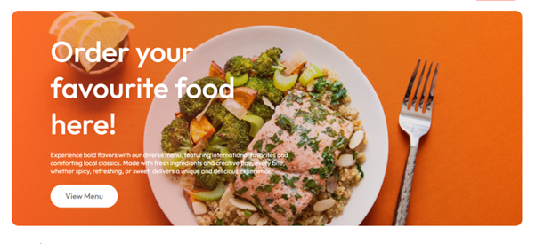
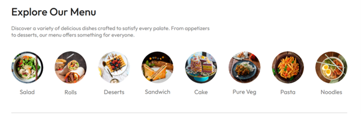

🍽️ Restaurant Website

A modern, responsive Restaurant Website built using React.js.
This project showcases the restaurant’s menu, services, and contact information — providing users with an intuitive and engaging dining experience online.

🚀 Features

🏠 Home Page – Eye-catching hero section with restaurant highlights.

🍴 Menu Page – Dynamic menu showcasing dishes with descriptions, images, and prices.

🧑‍🍳 About Page – Information about the restaurant, chefs, and story.

📞 Contact Page – Contact form with location map and business hours.

🛒 Online Ordering / Reservation (optional) – Enables users to reserve a table or order online.

📱 Responsive Design – Fully optimized for desktop, tablet, and mobile devices.

⚡ Fast Performance – Built with React components and optimized assets.

🛠️ Technologies Used

Category	                        Technology
Frontend	            React.js (with Vite or Create React App)
Styling 	            CSS3 / Tailwind CSS / Styled Components
Routing	                React Router DOM
Forms	                React Hook Form or Formik
Icons	                React Icons / Lucide React
Animations	            Framer Motion
API Integration         (optional)	Axios / Fetch API
Deployment	            Vercel / Netlify / GitHub Pages

🧾 License

This project is licensed under the MIT License – see the LICENSE
file for details.

